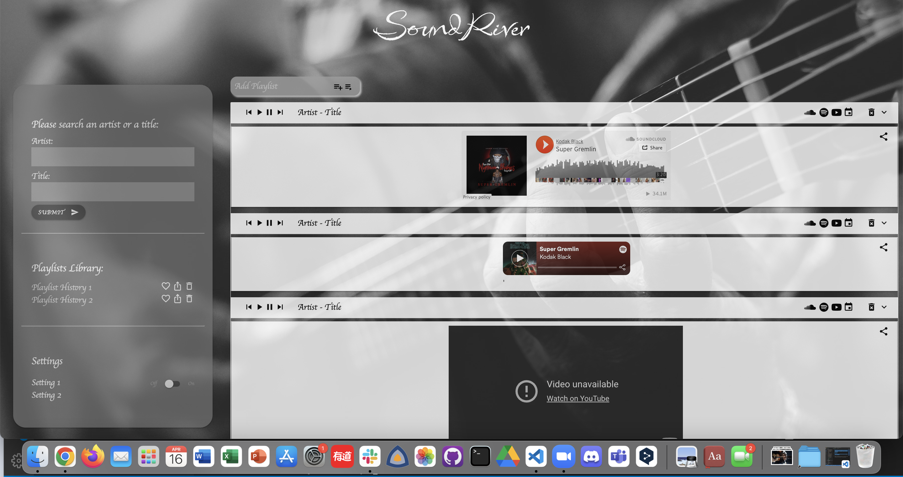
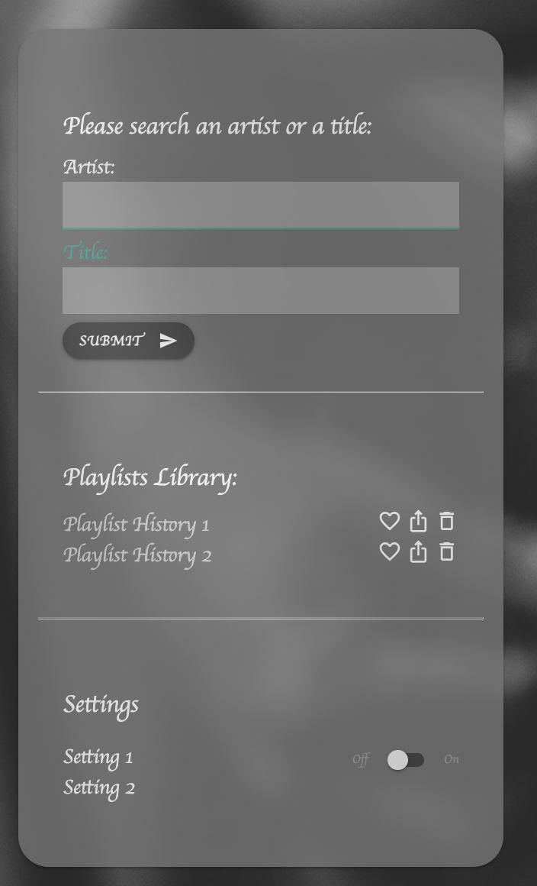
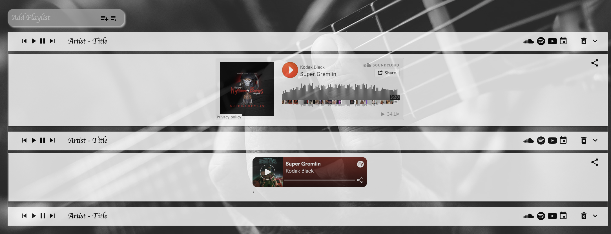

# SoundRiver Playlist Creator

By: Ali Baker, James Wong and Jessie Doherty

## Deployed site's URLs:

- GitHub Repo: https://github.com/AliBakerCodes/SoundRiver
- GitHub Pages: https://alibakercodes.github.io/SoundRiver/
- Google Slides Presentation: https://docs.google.com/presentation/d/1mdQqN_EmWeP6TkX70W0P3Sr9Q9E_owxQe3TXup7mfRg/edit#slide=id.p

## Concept:

- One-stop-shop for getting to know your favorite musician.
- Motivation for development?
  - Information sorting is powerful in this world.
  - Convenience for users to access information that interests them.
  - Share with a purpose with organized information.
  - Save time!

## User story:

The completed application should meet the following criteria:

- As a user, I want to enter the artist name and a title I want to search, then I’m presented with a list with anything related to that artist/title pulled from multiple platforms, as well as the upcoming events for that artist on eventbrite.
- Then I can create a unique playlist, and add that audio/video into my playlist; I can play the piece directly in this website;
- I can keep adding/deleting audio/videos to that specific playlist;
- I can create multiple playlists, delete or reorder them based on my needs;
- I can share my unique playlist with anyone online, or post to my social media accounts.
- API used: [SoundCloud](https://connect.soundcloud.com/sdk/sdk-3.3.2.js; https://w.soundcloud.com/player/api.js), [Youtube](https://www.youtube.com/iframe_api), [serpstack](http://api.serpstack.com/), [Eventbrite](https://www.eventbriteapi.com/v3).

## Process:

We've gone through the following process:

- Brainstorming --> Designing --> Planning --> Execution --> Debugging --> Delivery --> Presenting.
- Technology used: HTML, CSS, JavaScript, Materialize Framework, third-party APIs from SoundCloud, Google, Youtube, Eventbrite, serpstack, etc.

## The Homepage:

The [homepage] (https://alibakercodes.github.io/SoundRiver/) presents the following:

- A simple, elegant, and well thought-out UI.
  - The header only includes the title of the site;
  - Left side: there's a form with a text input field to capture a search queary, a Playlist Library where the user can manage the playlists, a setting section where the user can change settings to the playlists.
  - Right side: featured with a form to create a new playlist; a search result area where the content is dynamically presented by pulling information from multiple APIs.
  - Footer: Team introduction and contact information. When hover over or click a link, detalied information will show. A copyright statement is also presented.

**Specifically: **

- In the Search Area, a browser event listener is attached to the form to execute a function on submission, which will capture both form values and present the user with a search results page to the right with those values included in the URL as query parameters.

- In the Playlist Library section, the user can like, share, delete or reorder the playlists. When clicking on a playlist, an event listener will go to that playlist and present the playlist content in the search result section to the right.

- Right section: This is the playlist creation and search result area.
  - All search results will be presented in the right section of the page, including audio/video from multiple platforms, as well as URLs for events for that specific musician.
  - User can create a unique playlist, to which he/she can add/modify/remove content.
  - A newly created playlist will be added to the Playlist Library to the left.

## Assets:

The following image demonstrates the homepage's appearance and functionality:

The following image demonstrates the left section and its functionality:

The following image demonstrates the search results page's appearance and functionality:

The following image demonstrates the footer's appearance and functionality:

---

## Challenges:

- Framework is not always easy to use and maneuver.
- Some APIs have stricter rules than others so it's harder to pull in content.

## 🏆 Successes:

- Achieved basic framework and functionalities.
- Great teamwork.
- Moral support for each other.

## Future Development:

- Add more APIs to pull in content from more sites.
- Add a search engine to search playlists.
- Optimize tools and functionalities.
- Improve design on the search result area.
- Enrich content in the footer for future business development.
- Reach out to sponsors.
- Advertise the site via multiple channels.

## In conclusion:

Our team members have leveraged their individual skills and demonstrated the spirit of teamwork during the development of this website. Due to the limitation of time and our skills, we were only able to present the basic functionalities of this site. There's still a lot to learn, we hope to work together continoulsy to improve this website.
